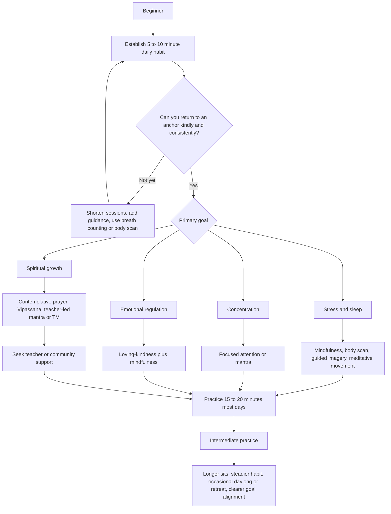

# Comprehensive Meditation Overview for a Beginner

## Executive summary

Meditation is not one technique but a family of practices that train attention, awareness, emotion, and behavior through repeated, structured exercises. The most useful beginner map is to distinguish between **focused attention** practices, **open monitoring** practices, **constructive** practices such as loving-kindness/compassion, and **deconstructive/insight** practices such as Vipassana; alongside these sit major traditional formats such as mantra, transcendental, movement-based, visualization, and contemplative prayer. In modern research and clinical practice, “mindfulness” often combines focused attention, open monitoring, body awareness, and informal daily-life practice rather than referring to a single technique. citeturn17view1turn28search1turn21view0turn17view5

For a true beginner with **unspecified goals**, the highest-confidence starting points are: breath-focused mindfulness, body scan, loving-kindness, and gentle meditative movement. The strongest clinical evidence is for **mindfulness-based programs** helping with stress, anxiety, depression, and to a smaller degree pain; evidence for sleep is promising but less uniform, and evidence differs sharply by technique and setting. Official guidance also emphasizes that meditation is generally low-risk but not risk-free; it should not replace medical or mental-health care, and practice should be adjusted if it increases distress, insomnia, dissociation, or destabilization. citeturn21view0turn17view5turn14search3turn14search12turn13search2turn13search3

The short answer to **“What is meditation a result of?”** is: **meditation is the result of repeated training conditions**—stable posture, intentional attention, repeated noticing-and-returning, embodied regulation, and habit-like repetition over time. In neuroscience terms, the best-supported mechanisms are enhanced self-regulation, attention control, emotion regulation, body awareness/interoception, and practice-dependent neuroplasticity; in contemplative traditions, meditation is also often described as arising from intention, discipline, and—in many lineages—ethical training and guidance. citeturn17view1turn21view2turn17view2turn26search2turn26search3turn20view0turn18view0

## Taxonomy of major meditation types and traditions

A useful way to organize the field is to combine the scientific taxonomy of attentional style with the traditional taxonomy of lineages and methods. That makes it easier to see both **what the mind is doing** and **what the tradition is aiming at**. citeturn17view1turn28search1turn21view0

| Practice | Roots and lineage | Typical goals | Common session structure and techniques | Typical beginner or program dose |
|---|---|---|---|---|
| **Mindfulness** | Buddhist roots; modern secular clinical form shaped by MBSR and related programs | Stress reduction, awareness, emotional regulation, daily-life presence | Sit, walk, stand, or lie down; use breath/body as anchor; notice thoughts, feelings, sensations; return without judgment; often includes body scan and walking meditation | Often starts with a few minutes daily and builds toward 10–20 minutes; formal MBSR programs commonly assign longer daily home practice |
| **Focused attention** | Broad cross-traditional concentration practice; close to samatha/concentration methods | Stability of attention, concentration, mental quiet | Choose one anchor such as breath, sound, counting, flame, or mantra; sustain attention; when distracted, return | Often 5–20 minutes daily at first |
| **Open monitoring** | Buddhist and nondual traditions; often follows some attentional stabilization | Meta-awareness, less reactivity, seeing thoughts as events | Begin with a brief settling phase; then widen attention to sounds, sensations, thoughts, and feelings without selecting one object; optional mental noting | Often introduced after some focused-attention stability; 10–20 minutes is common for beginners |
| **Loving-kindness / compassion** | Classical Buddhist metta/karuna and modern compassion trainings | Warmth, prosocial emotion, self-compassion, emotional repair | Settle attention; evoke goodwill toward self, benefactor, loved one, neutral person, difficult person, all beings; often uses phrases or imagery | Short daily practice works well; many guided practices are 7–20 minutes |
| **Mantra meditation** | Hindu, Buddhist, Sikh, tantric, and secular lineages | Settling, rhythm, concentration, devotional focus | Repeat a word, phrase, or syllable silently or aloud; use the repetition as an anchor; return when distracted | Often 10–20 minutes daily |
| **Transcendental Meditation** | Modern teacher-taught method associated with Vedic lineage and entity["people","Maharishi Mahesh Yogi","tm founder"] | Effortless settling, stress reduction, regular practice habit | Sit comfortably with eyes closed; use a teacher-given mantra; the official method emphasizes effortlessness rather than deliberate concentration | Official recommendation is 20 minutes twice daily |
| **Movement-based meditation** | Indian yoga; Chinese tai chi and qigong | Stress reduction, embodiment, mobility, balance, sleep, pain support | Slow movement linked with breath and attention; postures, transitions, body awareness, standing or floor practice, ending with stillness | From 10 minutes to 60 minutes depending on style; research protocols often use 2–7 sessions weekly |
| **Visualization / guided imagery** | Tibetan and other contemplative traditions; modern clinical relaxation and sports imagery | Relaxation, emotional rehearsal, sleep support, coping with stress or procedural distress | Relax body first; imagine a safe place, healing image, or beneficial figure/state; make the image sensory and emotionally vivid | Often 5–20 minutes, frequently guided |
| **Contemplative / prayer-based meditation** | Christian, Jewish, Islamic, and other devotional traditions; modern Centering Prayer is a specific Christian method associated with entity["people","Thomas Keating","centering prayer teacher"] | Prayerful receptivity, surrender, spiritual growth, meaning-making | Silent prayer, sacred word, repeated phrase, lectio divina, or receptive presence; thoughts are released rather than argued with | Highly variable; Centering Prayer commonly recommends 20 minutes twice daily |
| **Insight / Vipassana** | Theravada Buddhist insight meditation | Seeing impermanence, reactivity, and self-construction more clearly; liberation-oriented understanding | Often combines sitting and walking; uses breath/body to stabilize, then notes changing sensations, thoughts, and reactions clearly | Traditional home practice commonly ranges from 20–60 minutes daily; retreats intensify this substantially |

This table synthesizes official and primary or near-primary sources for MBSR and secular mindfulness, IMSB’s traditional Buddhist instructions, Berkeley’s loving-kindness guidance, the official TM description, NCCIH’s yoga/tai chi/qigong and relaxation pages, and Contemplative Outreach’s Centering Prayer method. citeturn30view0turn20view0turn19view0turn17view11turn17view6turn17view7turn17view8turn17view13turn18view0turn17view9

### Suitability matrix for common beginner goals

| Practice | Stress reduction | Concentration | Emotional regulation | Spiritual growth | Sleep | Pain management |
|---|---|---|---|---|---|---|
| **Mindfulness** | Strong | Good | Strong | Situational | Good | Good |
| **Focused attention** | Good | Strong | Situational | Situational | Situational | Situational |
| **Open monitoring** | Good | Good | Good | Good | Situational | Situational |
| **Loving-kindness / compassion** | Good | Situational | Strong | Good | Good | Unclear to situational |
| **Mantra meditation** | Good | Good | Good | Good | Good | Situational |
| **Transcendental Meditation** | Good | Good | Good | Situational to good | Situational | Unclear to situational |
| **Movement-based meditation** | Strong | Good | Good | Situational | Good | Good |
| **Visualization / guided imagery** | Good | Situational | Good | Situational | Strong | Situational |
| **Contemplative / prayer-based meditation** | Good | Situational | Good | Strong | Situational | Unclear |
| **Insight / Vipassana** | Good | Good | Good | Strong | Situational | Situational |

These ratings are a practical synthesis, not a medical prescription. They combine traditional aims with evidence summaries from JAMA, NCCIH, sleep reviews, compassion meta-analyses, and NCCIH’s yoga/tai chi/qigong and relaxation evidence. The clearest evidence base remains for mindfulness-based programs, while the evidence for mantra, prayer, guided imagery, and some movement-based uses is more heterogeneous or condition-specific. citeturn21view0turn17view5turn14search3turn14search12turn13search20turn37search5turn22view4turn22view5turn22view6turn22view2turn23view1turn17view13

## Beginner how-to by practice family

Because your goals are unspecified, the instructions below are ordered from **lowest-friction beginner practices** toward **more technique-sensitive or teacher-dependent approaches**.

### Mindfulness

1. Sit on a chair or cushion with the spine upright but not rigid.  
2. Let the hands rest comfortably; eyes may be closed or softly open.  
3. Feel contact points: feet on floor, seat under body, hands touching legs.  
4. Use the natural breath as the anchor, usually at the nostrils or belly.  
5. When thoughts pull you away, silently note “thinking” or simply notice the drift and return.  
6. End by expanding awareness to the whole body and environment.

**Common obstacles and troubleshooting:**  
The main beginner problem is not “failure to concentrate” but forgetting the task. Wandering is part of the repetition that builds skill. If you are sleepy, open the eyes, sit earlier in the day, or shorten the session. If restless, count breaths from 1 to 10 and restart when lost. If self-judgment appears, treat the return itself as the repetition that matters most.  

**Starter routine:** Week 1, 5 minutes on 5 days. Week 2, 8–10 minutes on 5 days. Week 3, 12–15 minutes on 5 days, adding one body scan. Week 4, 15–20 minutes on 5–6 days. This is a practical synthesis, not a canonical rule. citeturn20view0turn30view0turn26search2

### Focused attention

1. Choose **one** object only: breath, a candle flame, a sound, a count, or a neutral phrase.  
2. Settle posture first; then place attention on that single object.  
3. Narrow the task: “Stay with one inhale and one exhale.”  
4. If distracted, return directly without analyzing the distraction.  
5. Use breath counting if needed: 1 to 10, then begin again.

**Common obstacles and troubleshooting:**  
Focused attention often produces tension if the effort becomes too forceful. If the forehead, jaw, or throat tighten, reduce intensity and follow shorter intervals—one breath at a time. If boredom appears, notice that boredom is itself a mental event and return to the object. If distraction is constant, shorten the sit rather than pushing through in frustration.  

**Starter routine:** Begin with 5 minutes daily for a week; then 8–12 minutes; then 15 minutes; if stable, add two slightly longer sits in week 4. This style is especially strong if your primary goal is concentration training. citeturn21view2turn20view0turn37search0

### Open monitoring

1. Start with 2–5 minutes of focused breathing.  
2. Then widen awareness to whatever is most salient: sounds, thoughts, sensations, moods.  
3. The task is not to chase content but to observe events arising and passing.  
4. If you get swept into a story, return to the breath briefly, then reopen.  
5. End by noticing the whole field of experience at once.

**Common obstacles and troubleshooting:**  
The classic beginner trap is drifting into reverie and calling it “awareness.” Another is becoming too analytical. If you are no longer aware **that** you are thinking, narrow back to breath. If open awareness feels agitating or too diffuse, keep it brief and place it after a focused-attention phase rather than using it as your only practice. Some studies suggest FA feels more physically relaxing than OM for some people, which is one reason OM is not always the best bedtime practice.  

**Starter routine:** Weeks 1–2: only focused attention. Week 3: add 2–3 minutes of open monitoring after 8–10 minutes of focus. Week 4: gradually extend open monitoring to 5–8 minutes. citeturn20view0turn1search12turn37search11

### Loving-kindness and compassion

1. Sit or lie comfortably.  
2. Spend 30–60 seconds feeling the breath at the belly or chest.  
3. Bring to mind someone whose goodwill is easy to feel, or begin with yourself if that is softer.  
4. Repeat phrases such as “May I be safe. May I be well. May I be peaceful.”  
5. Move through a sequence: self, benefactor, loved one, neutral person, difficult person, all beings.  
6. If phrases feel mechanical, shift from wording to felt intention.

**Common obstacles and troubleshooting:**  
Many beginners do not feel warmth immediately. That is normal. The practice is not an emotion-manufacturing contest. If self-directed phrases trigger resistance, start with a benefactor or pet, then come back to yourself later. If a “difficult person” evokes too much activation, skip them until the practice feels stable.  

**Starter routine:** Use 7 minutes daily for 2 weeks; then 10–15 minutes, expanding the sequence gradually. This is an excellent complement to breath mindfulness if your goals include self-criticism, irritability, loneliness, or emotional regulation. citeturn19view0turn19view2turn20view0turn13search20turn37search5

### Mantra meditation

1. Choose a short phrase, prayer, or neutral syllable appropriate to your tradition or preferences.  
2. Sit comfortably and begin repeating it softly—silently or aloud depending on the method.  
3. Let the repetition be rhythmic, but not forced.  
4. Use the mantra as the anchor every time the mind wanders.  
5. If using a sacred phrase, keep the tone respectful and aligned with your tradition.

**Common obstacles and troubleshooting:**  
Beginners often repeat too loudly in the mind, which creates strain. Soften the repetition until it feels almost backgrounded. If the phrase loses meaning and becomes dull, that is not necessarily a problem; gentle repetition can still stabilize attention. If you become fixated on “doing it right,” simplify: one relaxed repetition at a time.  

**Starter routine:** 5 minutes daily in week 1, 8–10 minutes in week 2, 12–15 minutes in weeks 3–4. If you want a tradition-specific mantra, work with a qualified teacher rather than improvising from the internet. citeturn24search6turn24search3turn24search15

### Transcendental Meditation

For understanding the official method, the crucial point is that the TM organization does **not** present TM as a do-it-yourself text technique. The official description emphasizes comfortable sitting with eyes closed, a personalized one-on-one teaching process, and 20 minutes twice daily. Research reviews often classify it under mantra or “automatic self-transcending” styles, but the official lineage stresses that authentic instruction is teacher-led rather than reconstructed from summaries.  

**Common obstacles and troubleshooting:**  
The most relevant beginner note is practical: if what you want is **actual TM**, learn it through certified instruction; if what you want is “a mantra practice that resembles TM,” use the general mantra section above instead of assuming equivalence. citeturn17view11turn21view0

### Movement-based meditation

1. Choose a form that matches your body: chair yoga, gentle hatha, basic qigong, or beginner tai chi.  
2. Start with posture: feet grounded, knees soft, spine long, shoulders relaxed.  
3. Coordinate slow movement with slow breathing.  
4. Keep attention on body sensation and transitions rather than chasing flexibility or performance.  
5. End with 1–3 minutes of stillness or lying rest.

**Common obstacles and troubleshooting:**  
The main beginner mistake is treating meditative movement like exercise-only movement. Slow down enough that attention can stay continuous. If pain or dizziness appears, reduce range of motion, use support, or stop. For yoga, avoid extreme poses or forceful breathing at the start; NCCIH specifically warns that learning unsupervised, hot yoga, and advanced postures increase risk. For balance limitations, chair-based practice is appropriate.  

**Starter routine:** 10–15 minutes, 3–5 times per week for two weeks; then 15–20 minutes more regularly. If stress, sleep, or pain are priority goals, this family is often easier to sustain than silent sitting alone. citeturn17view6turn17view7turn17view8turn22view4turn22view5turn22view6turn38view1turn38view2turn38view3

### Visualization and guided imagery

1. Begin by relaxing the body and lengthening the exhale slightly.  
2. Create a simple scene: a quiet beach, forest path, safe room, or healing light.  
3. Make it sensory—temperature, sound, smell, texture, distance.  
4. If the image is faint, focus on the **felt sense** rather than movie-like clarity.  
5. If appropriate, pair the image with a phrase such as “safe,” “steady,” or “rest.”

**Common obstacles and troubleshooting:**  
Some people think they are “bad at visualization” because mental imagery is vague. High-definition imagery is unnecessary. If an image becomes emotionally loaded or unrealistic, return to a paired practice such as body scan or breathing. Guided imagery may be especially useful for winding down, procedures, or stress spikes, but the evidence base is broader and less standardized than for mindfulness-based programs.  

**Starter routine:** 5–10 minutes at bedtime or during stress for week 1; build to 10–15 minutes. This is often an easy entry point for people who dislike silent sitting. citeturn17view13turn25search3turn25search5turn25search18

### Contemplative and prayer-based meditation

1. Choose a quiet place and a devotional frame that fits your faith or practice.  
2. In Centering Prayer specifically, choose a sacred word that symbolizes consent to divine presence.  
3. Sit comfortably with eyes closed; briefly settle.  
4. When you notice you are entangled in thoughts, return gently to the sacred word or prayerful intention.  
5. End with a couple of minutes of silence.

**Common obstacles and troubleshooting:**  
People with religious backgrounds sometimes make this too effortful and evaluate themselves morally for distracting thoughts. In Centering Prayer, the point is receptive consent, not thought suppression. If the sacred word becomes tense or compulsive, soften it or consult a teacher or group.  

**Starter routine:** If using Centering Prayer, many practitioners begin with one 20-minute sit daily and later move toward the full twice-daily pattern if it remains nourishing and realistic. citeturn18view0turn5search3

### Insight and Vipassana

1. Begin with a few minutes of breath stability.  
2. Then attend closely to changing sensations, feeling tones, reactions, and thoughts.  
3. Use light noting if helpful: “hearing,” “pressure,” “thinking,” “planning,” “sadness.”  
4. Observe how experience changes without trying to freeze or improve it.  
5. Alternate sitting with short walking meditation if agitation rises.

**Common obstacles and troubleshooting:**  
Vipassana can become either too conceptual or too intense. If you start philosophizing about impermanence rather than observing it directly, return to raw sensation. If strong material emerges too fast, reduce duration, re-anchor in breath or touch points, and consider teacher support. This is often better introduced once some basic steadiness is present.  

**Starter routine:** Weeks 1–2: breath practice only. Week 3: add 2–3 minutes of noting. Week 4: alternate 10–15 minutes sitting with 5 minutes walking meditation. Guided support or a local group helps a great deal here. citeturn20view0turn17view9

## What meditation is and what it is a result of

**Meditation is best understood not as a mysterious state that appears from nowhere, but as a result of repeated training in attention, awareness, embodiment, and response style.** More concretely: meditation is a result of **intention + stable practice conditions + repetition + feedback**. In practice, that means posture, a chosen task, noticing distraction, returning, and repeating this loop enough times that the mind and body begin to change how they orient, regulate, and recover. citeturn17view1turn28search1turn26search3turn26search2

### Attention training and meta-awareness

A large share of meditation’s measurable effects seem to come from training attention and meta-awareness. Focused-attention practices strengthen the ability to orient to a chosen object and return after distraction; open-monitoring practices train the ability to observe mental events without immediately identifying with them. In one classic study, an 8-week mindfulness program improved orienting-related aspects of attention, while intensive retreat practice altered alerting-related processes. Experienced meditators also show differences in default-mode network activity associated with less habitual mind-wandering, although the meaning of such neural differences should not be overstated. citeturn21view2turn12search2turn17view5

### Body awareness, interoception, and autonomic regulation

Meditation is also a result of repeated contact with bodily signals. Breath, posture, and internal sensations provide a stream of interoceptive data that can stabilize attention and change how emotion is regulated. The 2015 neuroscience review proposed that mindfulness works through enhanced self-regulation involving attention control, emotion regulation, and self-awareness. Research on short-term meditation training has also suggested interactions between brain systems for attention and the autonomic nervous system. However, meta-analytic work on heart-rate-variability changes remains mixed, so it is safer to say that autonomic regulation is a plausible mechanism with uneven biomarker findings rather than a settled single-path explanation. citeturn17view1turn27search0turn27search11turn27search2

### Habit formation and practice dose

Meditation is partly a result of habit formation. Behavior-change research shows that habits develop through context-dependent repetition, and mindfulness intervention research shows a small but significant relationship between home practice and better outcomes. This does **not** mean “more is always better,” but it does mean that regular practice in a stable context—same chair, same time, same opening routine—makes adherence easier and deepens skill acquisition. That is why short daily practice usually beats heroic but sporadic long sessions for beginners. citeturn26search3turn26search21turn26search2

### Neuroplasticity and pain modulation

Meditation is also a result of neuroplastic learning. Structural and functional imaging studies suggest practice-related changes in networks involved in memory, self-referential processing, perspective taking, and emotion regulation. One MBSR study found gray-matter increases in regions including the hippocampus, posterior cingulate cortex, temporo-parietal junction, and cerebellum. Pain studies further suggest that mindfulness changes pain processing and appraisal: after brief training, one study found large reductions in pain unpleasantness and pain intensity during meditation. These results are promising, but official reviews also note that meditation research remains methodologically uneven and easy to overinterpret. citeturn17view2turn17view4turn17view5

### What contemplative traditions add

Scientific mechanism is not the only answer. Traditional systems usually say meditation is a result of **how one lives**, not just a technique. IMSB explicitly teaches that generosity and ethical restraint support concentration and insight, and that concentration and insight reinforce each other. In Centering Prayer, the practice is framed as both a relationship and a discipline. In TM, the official framing emphasizes transmission through a trained teacher and effortless regularity rather than self-invented method. So from a contemplative standpoint, meditation is often said to arise from **intention, ethical orientation, disciplined repetition, and guidance**. citeturn20view0turn18view0turn17view11

## Practical guidance

### Tools, apps, teachers, and self-study

For beginners, the best tools are usually the ones that reduce friction without making you dependent on endless novelty. Good high-confidence options include:

- urlUCLA Mindfulturn34search1 — free, multilingual, university-based guided meditations; UCLA notes that the app includes short guided practices and health-related meditations. citeturn34search1turn34search13  
- urlMindfulness Coachturn15search1 — free, gradual, self-guided mindfulness training from the U.S. Department of Veterans Affairs. citeturn15search1  
- urlHealthy Minds Programturn16search6 — free, science-based app with awareness, connection, and insight modules; an RCT reported benefits for well-being and stress-related outcomes. citeturn16search6turn16search15  
- urlOxford Mindfulnessturn31search1 — research-based courses and free 30-minute live online sessions suitable for maintaining a rhythm. citeturn31search1turn31search7turn31search10  
- urlUMass Center for Mindfulnessturn32search0 — useful if you want the original MBSR lineage. citeturn32search0turn32search12  
- urlUC San Diego Center for Mindfulness guided resourcesturn33search0 — good for free guided audio/video and structured mindfulness instruction. citeturn33search0turn33search5  
- urlInsight Meditation South Bayturn31search14 — strong for traditional mindfulness, concentration, metta, and Vipassana guidance. citeturn20view0turn17view9turn31search14  
- urlContemplative Outreachturn5search1 — best fit if you want a Christian contemplative path. citeturn18view0  
- urlTranscendental Meditation official siteturn2search1 — relevant if you specifically want TM’s teacher-led method rather than generic mantra work. citeturn17view11  
- urlHeadspaceturn15search4 — polished beginner onboarding and broad content library, but it is commercial and subscription-oriented. citeturn15search4turn15search8

In general, **self-study is usually enough** for basic mindfulness, body scan, loving-kindness, guided imagery, and gentle movement. A **teacher becomes more valuable** when you have trauma history, persistent anxiety during practice, spiritual goals, strong reactivity, chronic pain or mobility constraints, or an interest in tradition-specific methods such as TM, Centering Prayer, or deeper Vipassana. Official guidance from NCCIH also recommends asking about instructor training and experience before beginning a program you plan to do seriously. citeturn17view5turn17view11turn20view0turn18view0turn38view1turn38view2turn38view3

### Safety and contraindications

Meditation is generally low-risk, but it is not universally benign. Official NCCIH guidance says meditation and mindfulness usually appear to have few risks, while also noting that harms are under-studied. Systematic reviews and qualitative work describe possible adverse effects including anxiety, panic, traumatic re-experiencing, depersonalization, insomnia, pain amplification, and, in rare cases, more severe reactions such as psychosis-like experiences. The strongest warning signals are: rapidly worsening distress, functional decline, severe insomnia, flashbacks, dissociation, mania-like activation, hallucinations, or increased suicidality. If those occur, reduce or stop practice and seek a qualified clinician or trauma-informed teacher. citeturn17view5turn13search2turn13search3turn13search10turn36search1turn36search5

For movement-based meditation, the main safety issues are physical rather than psychiatric. NCCIH notes that yoga is generally safe when properly taught, but unsupervised learning, advanced poses, hot yoga, forceful breathing, and certain medical conditions raise risk. Tai chi and qigong appear broadly safe, but instructor quality and medical context still matter. Pregnant people, older adults, and people with glaucoma, balance problems, severe hypertension, spinal disease, or prior injury should modify practice. citeturn38view1turn38view2turn38view3

### Measuring progress

A beginner should measure progress less by “special experiences” and more by **consistency and transfer**. Useful signs of progress include: you sit more regularly with less resistance; you notice distraction sooner; you recover faster after stress; your body becomes easier to sense; and the practice starts to show up in ordinary moments such as walking, listening, eating, or pausing before reacting. For goal-specific tracking, use the simplest metric that matters: sleep latency and nighttime awakenings for sleep; pain interference rather than pain intensity alone for pain; days practiced per week for habit; and a 0–10 before/after stress rating for stress management. The home-practice literature supports taking regularity seriously, but chasing dramatic experiences is usually counterproductive. citeturn26search2turn30view0

### Recommended books, courses, and scientific reviews

For books, the strongest beginner-friendly recommendations are **entity["book","Full Catastrophe Living","kabat-zinn 1990"]**, which remains foundational for MBSR; **entity["book","Real Happiness","salzberg meditation guide"]**, a practical beginner-friendly program from entity["people","Sharon Salzberg","meditation teacher"]; and **entity["book","Open Mind, Open Heart","keating prayer book"]**, the clearest beginner entry for Centering Prayer. citeturn35search0turn35search2turn35search8

For ongoing courses, the best options depend on your preferred lens: MBSR lineage through urlUMass Center for Mindfulnessturn32search0, university-based secular mindfulness through urlOxford Mindfulnessturn31search1 or urlUC San Diego Center for Mindfulnessturn33search0, traditional Buddhist practice through urlInsight Meditation South Bayturn31search14, Christian contemplative practice through urlContemplative Outreachturn5search1, and official TM through urlTranscendental Meditationturn2search1. citeturn32search0turn31search1turn33search0turn31search14turn18view0turn17view11

If you want review papers rather than practice manuals, start with the Nature Reviews neuroscience article, the JAMA systematic review, Dahl’s cognitive-mechanisms paper, and NCCIH’s safety/effectiveness summary; together they give a fair picture of mechanism, evidence strength, and limitations. citeturn17view1turn21view0turn28search1turn17view5

## Four-week beginner schedule and progression

Because your goals are unspecified, the schedule below is designed as a **broad-spectrum beginner plan**: it prioritizes consistency, exposes you to several major families, and avoids jumping too quickly into more destabilizing or technique-sensitive styles.

| Week | Primary aim | Formal practice | Informal practice | Notes |
|---|---|---|---|---|
| **Week 1** | Build the habit | 5 minutes breath mindfulness on 5 days; 1 short body scan; 1 rest day | 3 mindful pauses per day, each 1–3 breaths | Keep it deliberately easy; the goal is continuity |
| **Week 2** | Add body awareness | 8–10 minutes mindfulness on 4 days; 7 minutes loving-kindness on 1 day; 10–15 minutes meditative movement on 2 days | One mindful daily activity such as showering, walking, or eating | Choose the same time and place most days |
| **Week 3** | Increase stability and variety | 12–15 minutes focused attention or mindfulness on 4 days; 10 minutes loving-kindness on 1 day; 15–20 minutes movement on 2 days | Brief check-in: “What is present right now?” once midday and once evening | If agitation rises, shorten before skipping |
| **Week 4** | Choose a primary path | 15–20 minutes on 5 days: 3 days mindfulness/FA, 1 day loving-kindness, 1 day visualization or contemplative prayer or brief open monitoring; 20 minutes movement on 2 days | One journal line after practice: “What helped? What hindered?” | At end of week 4, choose one main track for the next month |

This schedule reflects official beginner guidance that short daily practice is acceptable, evidence that regular home practice matters, and traditional advice to grow duration gradually rather than by force. citeturn30view0turn26search2turn20view0

A reasonable next step after these 4 weeks is to choose **one primary practice family** and keep **one complementary one**. For example: mindfulness plus loving-kindness; movement plus body scan; or contemplative prayer plus gentle breath awareness. citeturn28search1turn20view0turn18view0

The progression above is a synthesis of beginner practice recommendations, home-practice evidence, and the distinct aims of attentional, constructive, and contemplative families. citeturn26search2turn30view0turn28search1turn20view0turn18view0turn17view11

## Open questions and limitations

The evidence base is strongest for mindfulness-based interventions and much thinner or more heterogeneous for several other traditions, especially when using active-control comparisons rather than waitlists. Biomarkers such as brain imaging and heart-rate variability are promising but not always consistent or easy to interpret clinically. Your personal goals, mental-health history, religious background, pain status, and mobility constraints were **unspecified**, so the recommendations above are intentionally broad rather than personalized. citeturn21view0turn17view5turn27search2

## Sources

The report above draws most heavily on the following primary or authoritative sources:

- **Meditation and Mindfulness: Effectiveness and Safety** — urlNational Center for Complementary and Integrative Healthturn2search10. citeturn17view5  
- **The neuroscience of mindfulness meditation** — Nature Reviews Neuroscience. citeturn17view1  
- **Meditation Programs for Psychological Stress and Well-being: A Systematic Review and Meta-analysis** — JAMA Internal Medicine. citeturn21view0  
- **Mindfulness training modifies subsystems of attention** — a classic attention study. citeturn21view2  
- **Mindfulness practice leads to increases in regional brain gray matter density** — structural-neuroplasticity evidence. citeturn17view2  
- **Brain mechanisms supporting the modulation of pain by mindfulness meditation** — experimental pain-mechanism study. citeturn17view4  
- **Reconstructing and deconstructing the self: cognitive mechanisms in meditation practice** — major theoretical framework for attentional, constructive, and deconstructive families. citeturn28search1turn28search4  
- **Vipassana Practice** and **Meditation Practices** — urlInsight Meditation South Bayturn31search14. citeturn17view9turn20view0  
- **Centering Prayer** — urlContemplative Outreachturn5search1. citeturn18view0  
- **Transcendental Meditation Technique** — urlofficial TM siteturn2search1. citeturn17view11  
- **Tai Chi: What You Need To Know**, **Qigong: What You Need To Know**, and **Yoga: Effectiveness and Safety** — all from urlNCCIHturn2search10. citeturn17view6turn17view7turn17view8turn22view1turn22view2turn22view4turn22view5turn22view6turn38view1turn38view2turn38view3  
- **Relaxation Techniques: What You Need To Know** — urlNCCIHturn4search0. citeturn17view13  
- **Mindfulness exercises** — urlMayo Clinicturn10search5. citeturn30view0  
- **Home practice in MBCT and MBSR** and related habit-formation literature — for dose and adherence. citeturn26search2turn26search3turn26search21  
- **Adverse events in meditation practices** and **The varieties of contemplative experience** — for safety and adverse-effect context. citeturn13search2turn13search3turn13search10turn36search1