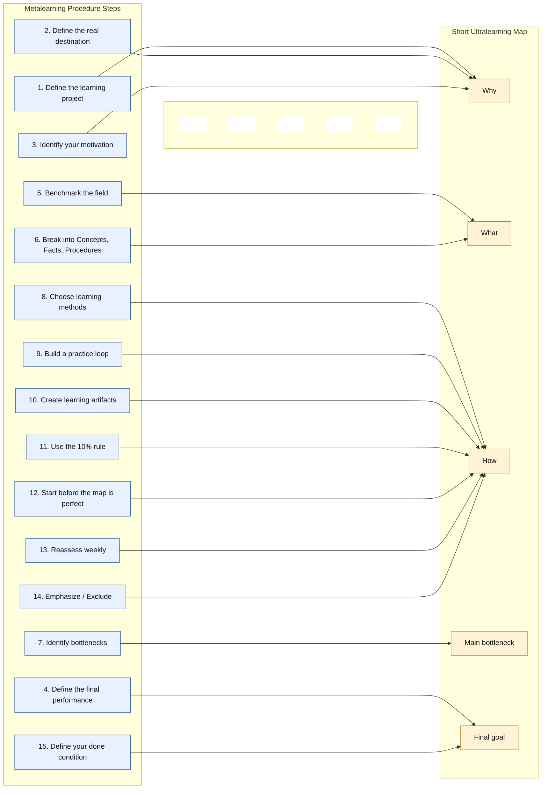

# Ultralearning

| [Flashcards](./flashcards.html) | [Quiz](./quiz.html) | [Report](./report.md) | [Report 2](./report_2.md) | [Report 3](./report_3.md) | [Mind Map](./mind_map.json) | [Source](./source.pdf) |

## Key Concepts

- **Directness:** learn in the context where performance will be judged; build, speak, solve, and practice instead of only consuming theory
- **Metalearning:** map why, what, and how before starting so the project has a clear path and avoids analysis paralysis
- **Ruthless feedback loops:** accelerate skill by practicing publicly, seeking real critique, and correcting quickly
- **Focus calibration:** match arousal to task complexity: intense alertness for simple drills and relaxed focus for complex work
- **Self-directed mastery:** use high-intensity learning to escape credential dependence and build rare, marketable capability

## Metalearning

