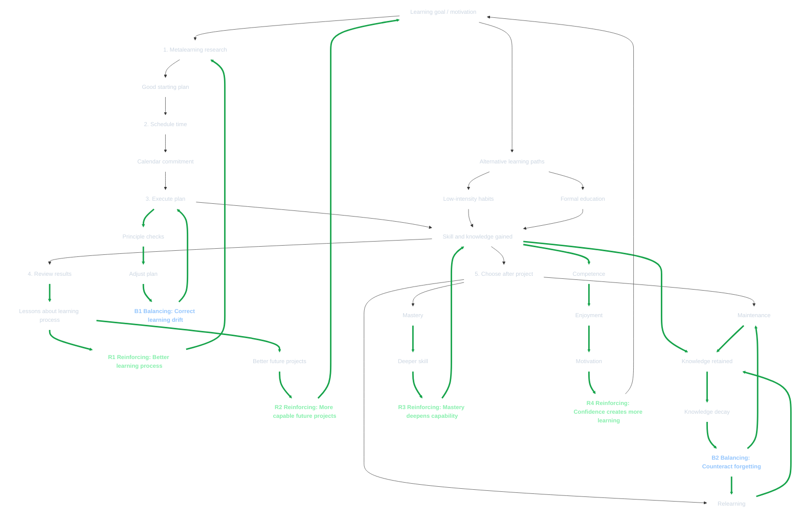
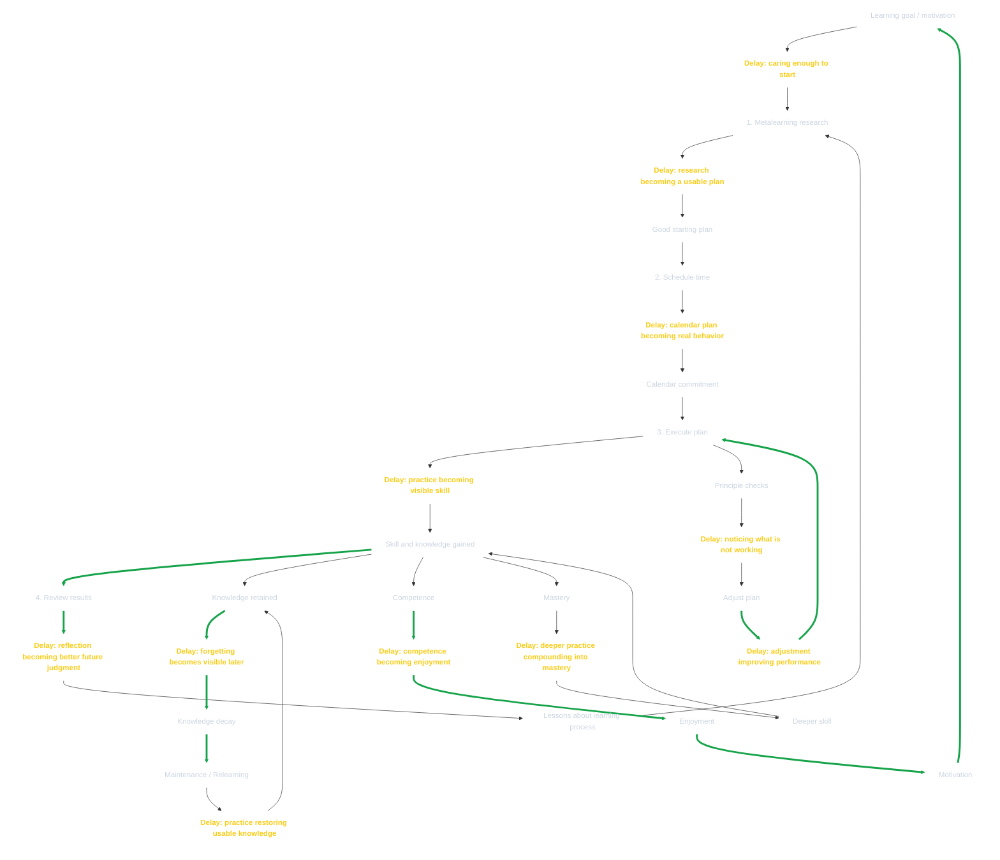
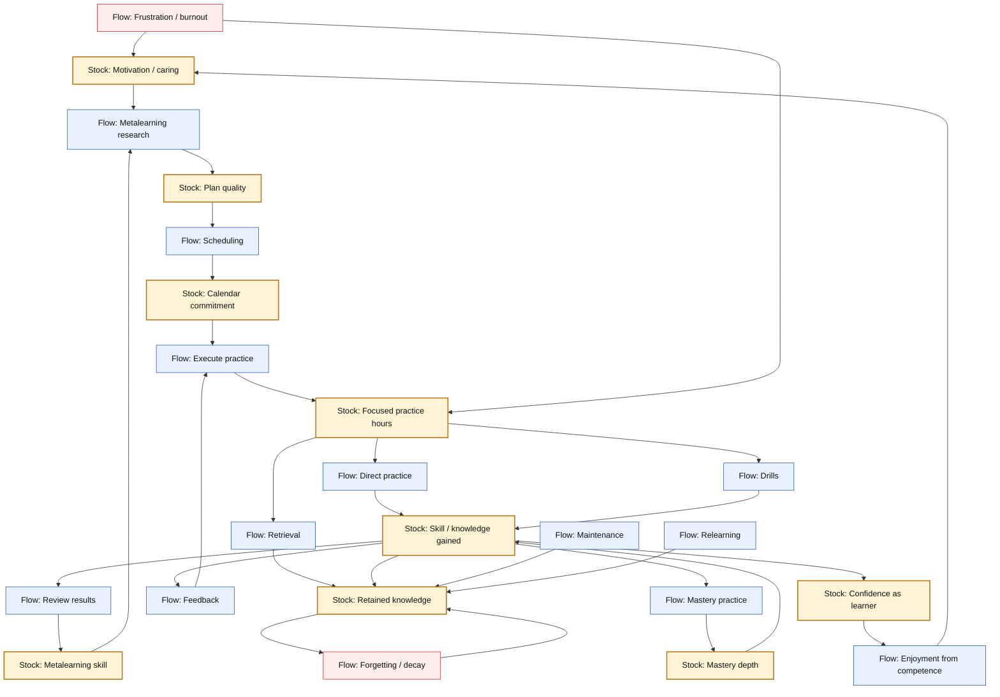
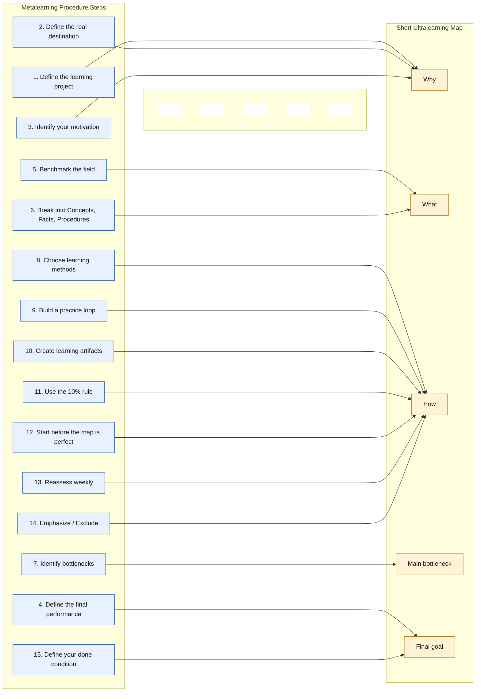

# Ultralearning

[](./slide_deck.pdf)

| [Flashcards](./flashcards.html) | [Quiz](./quiz.html) | [Report](./report.md) | [Report 2](./report_2.md) | [Report 3](./report_3.md) | [Mind Map](./mind_map.json) | [Source](./source.pdf) |

## Introduction

1. Learning
    - Broadening of the horizons of possibility.
    - Trying things out for yourself.
    - Thinking hard about the nature of the learning challenges you face.
    - Testing solutions to overcome them.
2. Ultralearning
    - A **strategy** for acquiring skills and knowledge.
    - Characteristics
        - **Self-directed**
        - **Intense**
        - **Willingness to prioritize deeply and effectively learning things**
3. Why Ultralearning Matters
    - Personal life
        - Your deepest moments of happiness
            - Don't come from doing easy things
            - Come from
                - Realizing your potential
                - Overcoming your own limiting beliefs about yourself
    - Economy
        - We're increasingly living in a world where the top performers do a lot better than the rest.
        - Factors
            - **skill polarization** as a result of computers and robots
            - **globalization** (medium-skilled jobs are outsourced to developing countries)
            - **regionalization** (an extension of globalization, with certain high-performing companies and cities making outsized impacts on the economy)
    - Work and Education
        - University tuition is
            - Too expensive
            - Doesn't teach skills needed to succeed in the new high-skilled jobs.
        - We're having to learn job skills by ourselves.
        - Rapidly changing fields mean that professionals need to constanly learn new skills and abilities to stay relevant.
        - Rapidly learning hard skills can have a greater impact than years of mediocre striving on the job.
4. How Technology helps accelerate Ultralearning
    - Top universities offer MOOCs.
    - Forums and discussion platform let you learn in groups.
    - Software tools for learning (eg. spaced-repetition software) accelerate the learning process itself.
5. Qualities of the best Ultralearners
    - Rarely motivated by professional success.
    - Driven forward by either
        - Their compelling vision of what they want to do.
        - A deep curiosity.
        - The challenge of ultralearning itself.
    - Blend the practical reasons for learning a skill with an inspiration that comes from something that excites them.
    - Have
        - Obsessive work ethic
        - Intensity
        - Initiative
        - Commitment to effective learning
6. Why see Ultralearning through Principles?
    - Every Ultralearning project is unique.
    - Principles
        - Allow you to solve problems, even those you may have never encountered before, in a way that a recipe or mechanical procedure cannot.
        - Make sense of the world, and even if they don't always articulate exactly how you should solve a particular challenge, they can provide immense guidance.
    - Take Ultralearning principles as flexible guidelines, rather than rigid rules.
    - Each ultralearning principle, if applied appropriately, will make you a better learner regardless of whether your starting point is dull or brilliant.

## Key Concepts

- **Directness:** learn in the context where performance will be judged; build, speak, solve, and practice instead of only consuming theory
- **Metalearning:** map why, what, and how before starting so the project has a clear path and avoids analysis paralysis
- **Ruthless feedback loops:** accelerate skill by practicing publicly, seeking real critique, and correcting quickly
- **Focus calibration:** match arousal to task complexity: intense alertness for simple drills and relaxed focus for complex work
- **Self-directed mastery:** use high-intensity learning to escape credential dependence and build rare, marketable capability

## Ultralearning Principles

1. [Metalearning: First draw a map](./principles/1_metalearning.md)
2. [Focus: Sharpen your knife](./principles/2_focus.md)
3. [Directness: Go straight ahead](./principles/3_directness.md)
4. [Drill: Attack your weakest point](./principles/4_drill.md)
5. [Retrieval: Test to learn](./principles/5_retrieval.md)
6. [Feedback: Don't dodge the punches](./principles/6_feedback.md)
7. [Retention: Don't fill a leaky bucket](./principles/7_retention.md)
8. [Intuition: Dig deep before building up](./principles/8_intuition.md)
9. [Experimentation: Explore outside your comfort zone](./principles/9_experimentation.md)

## Ultralearning Project Steps

> "The beginning is always today". — Mary Shelley
> 

The biggest **obstacle to ultralearning** is simply that **most people don’t care enough about their own self-education to get started**.

*Ultralearning projects aren’t easy. They require **planning, time, and effort**. Yet the rewards are worth the effort.*

Being able to learn hard things quickly and effectively is a powerful skill. One successful project tends to lead to others.

**It’s usually the first project that requires the most thought and care**.

- A solid, well-researched, well-executed plan can give you the confidence to face harder challenges in the future.
- A bungled attempt is not a disaster, but it may make you reluctant to pursue future projects of a similar nature.


1. [Do Your Research](./project_steps/1_research.md)
2. [Schedule Your Time](./project_steps/2_schedule.md)
3. [Execute Your Plan](./project_steps/3_execute.md)
4. [Review Your Results](./project_steps/4_review.md)
5. [Choose to Maintain or Master What You’ve Learned](./project_steps/5_maintain_or_master.md)

## Alternatives to Ultralearning: Low-Intensity Habits and Formal Instruction

Being an ultralearner doesn’t imply that everything one learns has to be done in the most aggressive and dramatic fashion possible.

Other strategies that can work with ultralearning, in different contexts.

1. Low-Intensity Habits
2. Formal, Structured Education

## Lifelong Learning

The goal of ultralearning is to

- Expand the opportunities available to you, not narrow them.
- Create new avenues for learning
- Push yourself to pursue them aggressively rather than timidly waiting by the sidelines

This is not going to be a method suitable for everyone, but for those who feel inspired to use it, it provides a start.

## Mapping: Ultralearning Project Steps × Ultralearning Principles

The **project steps** are the outer workflow: how you run an ultralearning project from beginning to end. The **principles** are the operating rules you apply inside that workflow. Your project notes lay out five project steps: metalearning research, scheduling, execution, review, and choosing maintenance/relearning/mastery afterward. 

---

### 1. High-Level Mapping

| Ultralearning Project Step                                | Main Principles Used                                                      | Purpose                                                                                                                                                                        |
| --------------------------------------------------------- | ------------------------------------------------------------------------- | ------------------------------------------------------------------------------------------------------------------------------------------------------------------------------ |
| **Step 1: Do your metalearning research**                 | **Metalearning, Directness, Drill, Feedback, Retention, Experimentation** | Build the map before starting. Decide what to learn, how to practice, what resources to use, where feedback comes from, and what bottlenecks may appear.                       |
| **Step 2: Schedule your time**                            | **Focus, Retention, Metalearning**                                        | Convert intention into protected time. Design a schedule that supports focus, spacing, and sustainability.                                                                     |
| **Step 3: Execute your plan**                             | **All 9 principles**                                                      | This is where the actual learning happens. You practice directly, focus deeply, retrieve, drill weak points, seek feedback, retain knowledge, build intuition, and experiment. |
| **Step 4: Review your results**                           | **Feedback, Metalearning, Experimentation, Retention**                    | Analyze what worked, what failed, what should change, and how to improve future projects.                                                                                      |
| **Step 5: Choose to maintain or master what you learned** | **Retention, Directness, Experimentation, Drill, Intuition**              | Decide whether to preserve, relearn, or deepen the skill after the project ends.                                                                                               |

---

### 2. Step-by-Step Mapping

#### Step 1: Do Your Metalearning Research

**Main principle:**
**1. Metalearning — First draw a map**

This step is almost entirely the Metalearning principle. You are answering:

```text
Why am I learning this?
What exactly must I learn?
How will I learn it?
What resources, methods, environments, and feedback sources will I use?
```

But Step 1 also quietly uses several other principles.

| Principle           | How it appears in Step 1                                                                                                                                                                          |
| ------------------- | ------------------------------------------------------------------------------------------------------------------------------------------------------------------------------------------------- |
| **Metalearning**    | Define topic, scope, resources, benchmark, concepts, facts, procedures, bottlenecks.                                                                                                              |
| **Directness**      | Decide how the skill will actually be used and design practice close to that use case.                                                                                                            |
| **Drill**           | Identify likely weak points and backup drills before starting.                                                                                                                                    |
| **Feedback**        | Identify where immediate, accurate, useful feedback will come from. Your feedback notes distinguish outcome, informational, and corrective feedback.                                              |
| **Retention**       | Decide whether the subject needs spacing, proceduralization, overlearning, mnemonics, or maintenance. Your retention notes emphasize that forgetting is the default and must be planned against.  |
| **Experimentation** | Decide what resources or methods you may test if the first plan does not work.                                                                                                                    |

**In one sentence:**

> Step 1 uses Metalearning to design the project, while borrowing Directness, Drill, Feedback, Retention, and Experimentation to make the design practical.

---

#### Step 2: Schedule Your Time

**Main principle:**
**2. Focus — Sharpen your knife**

Scheduling is not just logistics. It is an intervention against procrastination, distraction, and inconsistency.

| Principle           | How it appears in Step 2                                                                           |
| ------------------- | -------------------------------------------------------------------------------------------------- |
| **Focus**           | Decide when you will learn, protect the session, reduce distractions, and prevent procrastination. |
| **Retention**       | Use spaced sessions instead of cramming when memory matters.                                       |
| **Metalearning**    | Use your knowledge of your own capacity, motivation, and schedule to design a realistic plan.      |
| **Experimentation** | Use a pilot week for longer projects to test whether the schedule works.                           |

Your project notes say it is better to decide in advance how much time you will devote than to hope you find time later, and they recommend a pilot week for long projects. 

**In one sentence:**

> Step 2 turns the learning plan into a repeatable time structure that protects focus and supports retention.

---

#### Step 3: Execute Your Plan

**Main principle:**
**All 9 principles**

Execution is where every principle becomes active.

Your project notes explicitly list the nine principles as questions to ask during execution: Metalearning, Focus, Directness, Drill, Retrieval, Feedback, Retention, Intuition, and Experimentation. 

| Principle              | Execution question                                                               |
| ---------------------- | -------------------------------------------------------------------------------- |
| **1. Metalearning**    | Am I still using the right map, resources, and strategy?                         |
| **2. Focus**           | Am I actually concentrating, or am I distracted and procrastinating?             |
| **3. Directness**      | Am I practicing the skill in the way I will actually use it?                     |
| **4. Drill**           | Am I attacking the weakest subskill or rate-limiting step?                       |
| **5. Retrieval**       | Am I testing myself from memory, or just rereading?                              |
| **6. Feedback**        | Am I getting useful information about what is wrong and how to improve?          |
| **7. Retention**       | Am I spacing, overlearning, proceduralizing, or otherwise preventing forgetting? |
| **8. Intuition**       | Am I deeply understanding, explaining, proving, and using examples?              |
| **9. Experimentation** | Am I trying better methods when my current approach stops working?               |

**In one sentence:**

> Step 3 is the battlefield where the nine principles guide moment-to-moment learning behavior.

---

#### Step 4: Review Your Results

**Main principles:**
**Feedback, Metalearning, Experimentation**

After the project, you ask:

```text
What went right?
What went wrong?
What should I do differently next time?
```

Your project notes emphasize that even successful projects should be analyzed because they reveal what you want to retain and replicate. 

| Principle           | How it appears in Step 4                                               |
| ------------------- | ---------------------------------------------------------------------- |
| **Feedback**        | Treat the entire project as feedback on your learning system.          |
| **Metalearning**    | Convert project experience into better future learning maps.           |
| **Experimentation** | Decide which methods worked, which failed, and what to test next time. |
| **Retention**       | Decide what knowledge is likely to decay and what needs maintenance.   |

**In one sentence:**

> Step 4 turns one learning project into improved learning ability for the next project.

---

#### Step 5: Choose to Maintain or Master What You’ve Learned

**Main principle:**
**7. Retention — Don’t fill a leaky bucket**

This step exists because learning decays unless you decide what happens after the project.

Your project notes list three post-project options:

```text
1. Maintenance
2. Relearning
3. Mastery
```

And your retention notes explain that forgetting happens through decay, interference, and forgotten cues, so knowledge needs spacing, proceduralization, overlearning, or other retention mechanisms.  

| Choice          | Main principles involved                      |
| --------------- | --------------------------------------------- |
| **Maintenance** | Retention, Directness                         |
| **Relearning**  | Retention, Retrieval                          |
| **Mastery**     | Experimentation, Drill, Directness, Intuition |

**In one sentence:**

> Step 5 decides whether the skill will be preserved, reactivated later, or deepened into mastery.

---

### 3. Matrix View

| Principle              | Step 1: Research | Step 2: Schedule | Step 3: Execute | Step 4: Review | Step 5: Maintain/Master |
| ---------------------- | ---------------: | ---------------: | --------------: | -------------: | ----------------------: |
| **1. Metalearning**    |          Primary |        Secondary |    Active check |        Primary |               Secondary |
| **2. Focus**           |        Secondary |          Primary |         Primary |      Secondary |               Secondary |
| **3. Directness**      |          Primary |        Secondary |         Primary |      Secondary |                 Primary |
| **4. Drill**           |        Secondary |                — |         Primary |      Secondary |     Primary for mastery |
| **5. Retrieval**       |        Secondary |        Secondary |         Primary |      Secondary |  Primary for relearning |
| **6. Feedback**        |          Primary |                — |         Primary |        Primary |               Secondary |
| **7. Retention**       |          Primary |          Primary |         Primary |      Secondary |                 Primary |
| **8. Intuition**       |        Secondary |                — |         Primary |      Secondary |     Primary for mastery |
| **9. Experimentation** |        Secondary |        Secondary |         Primary |        Primary |     Primary for mastery |

Legend:

```text
Primary = central to this step
Secondary = useful but not the main focus
Active check = used to monitor whether the step is still working
```

---

### 4. The System Logic

The project steps form the **macro-cycle**:

```text
Research → Schedule → Execute → Review → Maintain / Master
```

The principles form the **micro-controls** inside the cycle:

```text
Metalearning tells you where to go.
Focus gives you usable attention.
Directness keeps practice tied to reality.
Drill attacks bottlenecks.
Retrieval makes memory stronger.
Feedback corrects errors.
Retention prevents decay.
Intuition deepens understanding.
Experimentation improves the system when old methods stop working.
```

### Short Version

```text
Step 1: Research
→ Metalearning, Directness, Feedback, Drill, Retention

Step 2: Schedule
→ Focus, Retention, Metalearning

Step 3: Execute
→ All 9 principles

Step 4: Review
→ Feedback, Metalearning, Experimentation

Step 5: Maintain or Master
→ Retention, Retrieval, Directness, Drill, Intuition, Experimentation
```

The cleanest way to understand it:

```text
Project steps = the lifecycle of the learning project.
Principles = the control system that keeps the project effective.
```

---

## Systems View of Ultralearning

Ultralearning is a feedback system where

- metalearning creates the plan
- scheduling creates commitment
- execution creates skill
- review improves your learning process
- post-project choice prevents knowledge from decaying or turns it into mastery



| Loop                                     | Type            | Why                                                                                                                            |
| ---------------------------------------- | --------------- | ------------------------------------------------------------------------------------------------------------------------------ |
| **R1: Better learning process**          | **Reinforcing** | Reviewing results improves your metalearning, which improves future plans, which improves future results.                      |
| **B1: Correct learning drift**           | **Balancing**   | Principle checks detect when execution is off-track and push you back toward better practice.                                  |
| **R2: More capable future projects**     | **Reinforcing** | Lessons from one project make future projects stronger, which creates more learning success.                                   |
| **B2: Counteract forgetting**            | **Balancing**   | Knowledge decay is countered by maintenance or relearning, stabilizing retained knowledge.                                     |
| **R3: Mastery deepens capability**       | **Reinforcing** | Choosing mastery creates deeper skill, which increases capability and opens further mastery.                                   |
| **R4: Confidence creates more learning** | **Reinforcing** | Skill creates competence, competence creates enjoyment, enjoyment increases motivation, and motivation leads to more learning. |


## Delays in the Ultralearning System

A **delay** is the time gap between taking an action and seeing its effect.

In this ultralearning system, delays matter because you may be doing the right thing, but the result appears later. That delay can make you falsely think the method is not working.



### The Most Important Delays

#### 1. Motivation → Starting

You may intellectually want to learn, but not yet care enough to commit. This is the first delay: the gap between **interest** and **actual project initiation**.

#### 2. Metalearning research → Good plan

Research does not instantly become clarity. You may need time to compare resources, define scope, benchmark others, and identify direct practice.

Danger: quitting because planning feels slow.

#### 3. Schedule → Real behavior

Putting time on the calendar is not the same as actually showing up. There is a delay between **scheduled commitment** and **habit formation**.

Danger: thinking the plan failed when the real issue is that the schedule has not yet become automatic.

#### 4. Practice → Visible skill

This is probably the biggest one.

You may practice for days or weeks before your improvement becomes obvious. Skill often improves beneath the surface before performance visibly jumps.

Danger: stopping too early.

#### 5. Principle checks → Useful correction

You may be distracted, using weak resources, avoiding direct practice, or failing to retrieve from memory — but it may take time to notice the pattern.

Danger: continuing ineffective practice because the feedback signal is delayed.

#### 6. Adjustment → Better results

Even after you correct the plan, the benefit is not immediate. Better drills, better feedback, or more direct practice may need several sessions before results appear.

Danger: changing methods too frequently before the new method has time to work.

#### 7. Learning → Forgetting

Forgetting is delayed. You may feel like you know something today, but discover later that it decayed.

Danger: confusing short-term familiarity with durable retention.

#### 8. Maintenance / relearning → Restored skill

Once knowledge decays, maintenance or relearning can restore it, but not instantly. There is a delay between restarting practice and regaining usable fluency.

#### 9. Competence → Enjoyment → Motivation

Enjoyment often comes **after** competence, not before. Early learning may feel frustrating, but once you become capable, the activity becomes more rewarding.

Danger: expecting learning to feel fun before you are good.

#### 10. Mastery → Deeper capability

Mastery compounds slowly. The results of deeper practice, experimentation, and refinement may appear only after many cycles.

Danger: underestimating how long excellence takes.

### The key insight

The dangerous delays are:

```text
Practice → visible skill
Feedback → correct adjustment
Learning → long-term retention
Competence → enjoyment
```

These are the places where people are most likely to misread the system and quit too early.

## Stocks and flows in this ultralearning system

In systems thinking:

```text
Stock = something that accumulates or depletes over time.
Flow = the rate or activity that increases or decreases a stock.
```

Based on your ultralearning project notes. 

### Main stocks

| Stock                        | What accumulates?                                     | Increased by                                    | Decreased by                                   |
| ---------------------------- | ----------------------------------------------------- | ----------------------------------------------- | ---------------------------------------------- |
| **Motivation / caring**      | Desire to start and continue learning                 | competence, enjoyment, meaningful goal          | frustration, unclear purpose, fatigue          |
| **Plan quality**             | Clarity of scope, resources, benchmark, practice plan | metalearning research                           | poor research, wrong scope, weak resources     |
| **Calendar commitment**      | Protected learning time                               | scheduling, pilot week, consistency             | life conflicts, weak prioritization            |
| **Focused practice hours**   | Actual deep learning time                             | showing up, focus, direct practice              | procrastination, distraction, skipped sessions |
| **Skill / knowledge gained** | Current ability in the subject                        | effective practice, retrieval, feedback, drills | forgetting, shallow practice, lack of use      |
| **Retained knowledge**       | Knowledge that remains usable over time               | spaced repetition, overlearning, maintenance    | knowledge decay                                |
| **Metalearning skill**       | Ability to design better learning projects            | reviewing results, repeated projects            | not reflecting after projects                  |
| **Confidence as learner**    | Belief that you can learn hard things                 | successful projects, visible progress           | failed projects without review, poor execution |
| **Mastery depth**            | Deeper expertise beyond the first project             | continued practice, follow-up projects          | stagnation, lack of challenge                  |

### Main flows

| Flow                          | What it does                                        |
| ----------------------------- | --------------------------------------------------- |
| **Metalearning research**     | Increases plan quality                              |
| **Scheduling**                | Converts intention into calendar commitment         |
| **Execution / practice**      | Converts scheduled time into focused practice hours |
| **Direct practice**           | Converts practice hours into usable skill           |
| **Drills**                    | Strengthen weak parts of the skill                  |
| **Retrieval practice**        | Strengthens memory and retained knowledge           |
| **Feedback**                  | Improves practice quality by revealing errors       |
| **Review after project**      | Converts experience into metalearning skill         |
| **Forgetting / decay**        | Decreases retained knowledge over time              |
| **Maintenance**               | Slows or reverses knowledge decay                   |
| **Relearning**                | Restores decayed knowledge                          |
| **Mastery practice**          | Converts basic skill into deeper skill              |
| **Enjoyment from competence** | Increases motivation                                |
| **Frustration / burnout**     | Decreases motivation and practice consistency       |

### System diagram: stocks and flows



### The most important stock

The central stock is:

```text
Skill / knowledge gained
```

But the **most powerful hidden stock** is:

```text
Metalearning skill
```

Because every completed project improves your ability to design the next project. That is why ultralearning compounds.

### The most dangerous outflow

The most dangerous outflow is:

```text
Forgetting / decay
```

That is why the final step matters: after learning, you choose **maintenance, relearning, or mastery**. Without that choice, the stock of retained knowledge slowly drains.

## Elements, Interconnections, and Function/Purpose

For this system, the **system boundary** is:

> **An ultralearning project from initial motivation to post-project maintenance, relearning, or mastery.** 

---

### 1. Elements

The **elements** are the parts inside the system.

#### Main project elements

| Element                            | Role in the system                                                                                  |
| ---------------------------------- | --------------------------------------------------------------------------------------------------- |
| **Learning goal / motivation**     | The reason the project begins.                                                                      |
| **Metalearning research**          | Defines the topic, scope, resources, benchmark, direct practice, backup materials, and drills.      |
| **Learning plan**                  | The starting design for the project.                                                                |
| **Schedule / calendar commitment** | Converts intention into protected learning time.                                                    |
| **Execution sessions**             | The actual learning work.                                                                           |
| **Ultralearning principles**       | Metalearning, focus, directness, drill, retrieval, feedback, retention, intuition, experimentation. |
| **Skill / knowledge gained**       | The main learning output.                                                                           |
| **Review process**                 | Examines what went right, what went wrong, and what to change next time.                            |
| **Post-project choice**            | Decide whether to maintain, relearn later, or pursue mastery.                                       |
| **Future projects**                | Later learning projects improved by experience.                                                     |

---

### 2. Interconnections

The **interconnections** are how the parts affect each other.

#### Core project chain

```text
Motivation
→ Metalearning research
→ Good starting plan
→ Schedule
→ Calendar commitment
→ Execute plan
→ Skill / knowledge gained
→ Review results
→ Better future learning process
```

This is the main flow of the system.

---

#### Planning-quality connection

```text
Better metalearning research
→ Better plan
→ Better execution
→ Better results
```

If the research is weak, the project may start with the wrong scope, wrong resources, or weak practice methods.

---

#### Commitment connection

```text
Scheduling time
→ Higher priority
→ More consistent execution
→ More focused practice
```

The calendar does not directly create skill, but it increases the likelihood that practice actually happens.

---

#### Execution-adjustment connection

```text
Execute plan
→ Check against ultralearning principles
→ Notice mismatch
→ Adjust plan
→ Execute better
```

This is the correction system. It prevents you from continuing ineffective learning blindly.

---

#### Retention connection

```text
Skill / knowledge gained
→ Knowledge retained
→ Knowledge decay
→ Maintenance / relearning
→ Knowledge retained
```

Without intervention, knowledge decays. Maintenance and relearning counteract that decay.

---

#### Mastery connection

```text
Skill gained
→ Choose mastery
→ Deeper practice
→ Deeper skill
→ More capability
```

Mastery extends the project beyond basic competence.

---

#### Confidence connection

```text
Successful project
→ Competence
→ Enjoyment
→ Motivation
→ More future learning projects
```

This is why the first ultralearning project matters so much. A successful project makes future projects easier to begin.

---

### 3. Function / Purpose

The **explicit purpose** of the system is:

> **To learn a hard skill or subject quickly and effectively through a self-directed, intense learning project.**

But the deeper purpose is bigger:

> **To improve your ability to learn future hard things.**

Your notes say the goal of ultralearning is not merely to learn one skill or subject, but to hone and enhance your overall learning process. Each successful project can be refined and improved for the next one. 

So the function has three levels:

| Level                 | Purpose                                                                  |
| --------------------- | ------------------------------------------------------------------------ |
| **Immediate purpose** | Learn the chosen skill or subject.                                       |
| **Project purpose**   | Complete a well-designed ultralearning project.                          |
| **Long-term purpose** | Become a stronger lifelong learner who can repeatedly learn hard things. |

### Short version

```text
Elements:
Motivation, metalearning research, plan, schedule, execution, principles, skill gained, review, post-project choice.

Interconnections:
Research improves the plan.
Schedule protects execution.
Execution builds skill.
Principle checks correct drift.
Review improves future projects.
Maintenance/relearning counteracts forgetting.
Mastery deepens capability.

Function/Purpose:
Learn one hard thing now while improving the system that helps you learn hard things in the future.
```

## Key intervention points in the ultralearning system

A **point of intervention** is a place where a small change can improve the behavior of the whole system.

For this ultralearning system, the best interventions are not just “study harder.” They are places where you can change the **structure** of the learning system: goals, schedule, practice, feedback, review, retention, and post-project decisions. Based on your uploaded ultralearning project notes. 

---

### 1. Clarify the learning goal early

**Intervention point:** Before metalearning research.

```text
Vague goal → weak plan → weak execution
Clear goal → focused research → better plan
```

Bad:

```text
Learn logic.
```

Better:

```text
Finish Duke Logic and Critical Thinking and become able to analyze real-world arguments.
```

This is a high-leverage intervention because the goal determines the **scope**, **resources**, **practice activities**, and **success criteria**.

---

### 2. Narrow the scope

**Intervention point:** Metalearning research.

A huge project creates friction. A narrow project creates motion.

Bad:

```text
Master critical thinking.
```

Better:

```text
Complete Course 1 and analyze 20 real-world arguments by identifying premises, conclusions, and hidden assumptions.
```

Narrow scope reduces overwhelm, makes scheduling easier, and creates faster feedback.

---

### 3. Choose better primary resources

**Intervention point:** Resource selection.

Your notes emphasize identifying books, videos, classes, tutorials, guides, mentors, coaches, and peers before beginning. This matters because weak resources create hidden drag. 

The intervention is:

```text
Do not ask: “What resource is available?”
Ask: “What resource best supports the skill I actually need to perform?”
```

---

### 4. Benchmark successful learners

**Intervention point:** Before finalizing the plan.

Benchmarking prevents you from missing obvious paths.

Ask:

```text
How have others successfully learned this?
What curriculum do good courses use?
What exercises do they repeat?
What mistakes do beginners make?
```

This improves the plan before you waste effort.

In system terms:

```text
Benchmarking → better plan quality → better practice → better results
```

---

### 5. Build direct practice into the plan

**Intervention point:** Practice design.

This may be the most important intervention.

The system fails when learning becomes indirect:

```text
watching videos
taking notes
highlighting
feeling familiar
```

The system improves when learning becomes direct:

```text
analyze real arguments
reconstruct premises and conclusions
find hidden assumptions
evaluate reasoning
diagnose fallacies
repair weak arguments
```

---

### 6. Put learning time on the calendar

**Intervention point:** Scheduling.

Your notes say it is better to decide in advance how much time you are willing to devote than to hope you will find time later. 

This intervention converts intention into structure.

```text
Intention → weak
Calendar commitment → stronger
Repeated calendar commitment → habit
```

The key rule:

```text
Do not merely decide to learn.
Decide exactly when learning happens.
```

---

### 7. Run a pilot week

**Intervention point:** Before long projects.

For projects of six months or more, your notes recommend testing the schedule for one week before committing. 

This is a very powerful balancing intervention.

It prevents:

```text
overconfidence → unrealistic schedule → burnout → abandonment
```

Instead:

```text
pilot week → schedule correction → sustainable plan
```

---

### 8. Protect focus during execution

**Intervention point:** Learning sessions.

Focus is where scheduled time becomes real learning.

Bad system:

```text
Calendar says study
But session is distracted
So practice hours do not become skill
```

Better system:

```text
Phone away
One clear task
Timer started
Direct practice
Quick review
```

For this course:

```text
One focused session = one lesson + one argument reconstruction + one recall-on-paper summary.
```

---

### 9. Add retrieval practice

**Intervention point:** Memory formation.

Retrieval changes the flow from passive exposure to active recall.

Instead of:

```text
read notes again
```

Do:

```text
close notes
write what you remember
compare
correct
repeat later
```

This directly improves the stock of **retained knowledge**.

For logic:

```text
Recall definitions.
Recall fallacy structures.
Recall argument evaluation steps.
Reconstruct from memory.
```

---

### 10. Use drills for bottlenecks

**Intervention point:** Weakest subskill.

A drill isolates the part that is slowing the whole system.

For the Duke specialization, likely drills are:

```text
Premise/conclusion drill
Hidden assumption drill
Deductive vs inductive classification drill
Fallacy diagnosis drill
Argument repair drill
```

This is a high-leverage intervention because it targets the **rate-limiting step**.

---

### 11. Get feedback early

**Intervention point:** Error correction.

Without feedback, you may practice wrong.

For this system:

```text
Practice without feedback → confidence may rise while skill stays weak
Practice with feedback → errors become visible → method improves
```

Feedback sources:

```text
Coursera quizzes
Instructor explanations
Comparing your reconstruction to examples
Asking someone to critique your argument
Using a checklist
```

The earlier the feedback, the less time you waste reinforcing mistakes.

---

### 12. Reassess weekly

**Intervention point:** Execution correction loop.

This is where the system becomes adaptive.

Ask weekly:

```text
Am I using the right resources?
Am I practicing directly?
Am I retrieving or just reviewing?
What is my bottleneck?
What should I emphasize next week?
What should I exclude?
```

This keeps the system from drifting.

In systems terms, this is a **balancing loop**:

```text
execution drift → principle check → adjustment → better execution
```

---

### 13. Review the project after completion

**Intervention point:** After results.

Your notes emphasize asking what went right, what went wrong, and what to do differently next time. 

This is one of the most important interventions because it turns one project into improved future projects.

```text
Finished project → review → better metalearning skill → better next project
```

Without review, the learning system does not compound.

---

### 14. Decide: maintenance, relearning, or mastery

**Intervention point:** After learning.

This prevents silent decay.

After finishing, choose:

```text
Maintenance:
Keep the skill usable.

Relearning:
Let some details decay, but plan to reactivate later.

Mastery:
Go deeper through another project or continued practice.
```

This is a major leverage point because the system does not end when the course ends. Without a post-project choice, knowledge decays by default.

---

### 15. Convert success into identity and confidence

**Intervention point:** Motivation loop.

A successful project should not merely produce a skill. It should also produce a new self-belief:

```text
I can learn hard things.
```

That belief increases motivation for future projects.

This creates a reinforcing loop:

```text
successful project
→ competence
→ enjoyment
→ motivation
→ next project
→ more competence
```

This is why the first ultralearning project deserves extra care.

---

### Highest-leverage interventions, ranked

| Rank | Intervention                              | Why it matters                                    |
| ---: | ----------------------------------------- | ------------------------------------------------- |
|    1 | **Direct practice**                       | Converts study into usable skill.                 |
|    2 | **Clear scope**                           | Prevents overwhelm and wasted effort.             |
|    3 | **Calendar commitment**                   | Converts intention into repeated action.          |
|    4 | **Feedback early**                        | Prevents practicing incorrectly.                  |
|    5 | **Weekly reassessment**                   | Keeps the system adaptive.                        |
|    6 | **Drills for bottlenecks**                | Improves the weakest link.                        |
|    7 | **Post-project review**                   | Converts one project into better future projects. |
|    8 | **Maintenance/relearning/mastery choice** | Prevents knowledge decay.                         |

### Short version

```text
Key intervention points:

1. Clarify the goal.
2. Narrow the scope.
3. Choose strong resources.
4. Benchmark successful learners.
5. Build direct practice into the plan.
6. Put learning time on the calendar.
7. Run a pilot week for long projects.
8. Protect focus during sessions.
9. Use retrieval practice.
10. Drill bottlenecks.
11. Get feedback early.
12. Reassess weekly.
13. Review the project after completion.
14. Choose maintenance, relearning, or mastery.
15. Convert success into confidence for future projects.
```

The deepest intervention is this:

```text
Do not optimize “studying.”
Optimize the system that turns effort into skill.
```


## Metalearning

